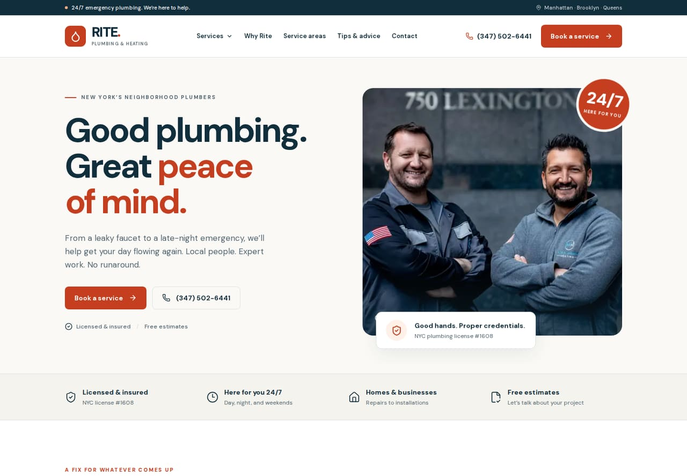
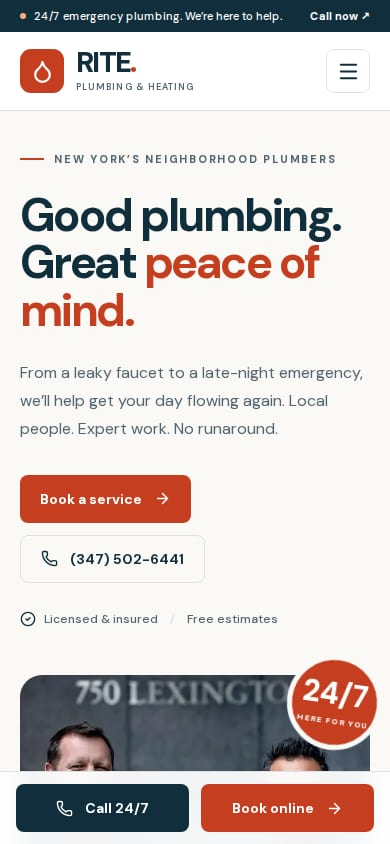

# Rite Plumbing — redesign

The original homepage emphasized decorative layouts and scheduling software while making the actual plumbing services difficult to scan. The redesign leads with the local team, the service promise, and direct booking and calling options.

The site now uses a consistent navy, warm white, and accessible orange palette; large readable headings; original company photographs; straightforward service cards; a compact navigation menu; and persistent mobile contact actions. The same system extends to all 14 services, the company page, contact page, advice pages, video page, and 404 page.

## Previews

## Validation

- `npm run check`: ESLint, generated route types, TypeScript, and production build passed.
- `npm run test:ui`: production browser checks passed.
- Homepage widths: 320, 375, 390, 768, 1024, 1280, 1440, and 1920 pixels; no horizontal overflow.
- Main pages and representative service and article pages checked at 390 and 1440 pixels.
- All 64 current and legacy service URLs returned successful responses and retained canonical service paths.
- Desktop services menu, Escape dismissal, mobile navigation and scroll restoration, FAQ disclosure, and mobile links checked.
- Email form validates required fields and ZIP codes, creates the correct draft, and explicitly explains that nothing has been sent.
- All booking buttons retain the existing Housecall Pro calendar. No live appointment was booked during testing.
- All homepage photos loaded. No browser JavaScript errors were observed.
- Automated axe-core audits found zero violations on the tested homepage desktop/mobile states, service index, company page, contact page, gas service page, and email confirmation state. These checks complement the visual and interaction review; they are not a complete accessibility certification.

## Booking and deployment

The active booking integration is the existing company Housecall Pro URL. The contact form prepares an email draft rather than claiming delivery through an unconfigured backend.

Deployment remains compatible with the repository’s existing Vercel setup. No hosting provider is changed. Canonical URLs use the configured site origin or Vercel hostname; preview deployments are excluded from indexing.
